# Arbitrary Style Transfer in Realtime
Neural Style Transfer is an technique where we generate an artistic version of the given content image styled similar to given style image. But the method was slow and took repeated iterations. But recently a paper **Arbitrary Style Transfer in Real-time with Adaptive Instance Normalization** [[See paper]](https://arxiv.org/abs/1703.06868) propsed a method that allows us to do style transfer on any two images in real time since it uses only a single feed forward neural network.

This notebook is an implementation of it using TF2 API. 

### Results
Here are some of the results when trained with the hyperparameter alpha = .7 that is .7 tendency towards style image while .3 towards the original image.

> Note: I have only trained the model on 200 style and content images. With more data, superior decoder architecture and much training much better results could be obtained.

Set of Content + Style => Result

   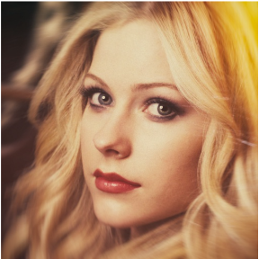
   
   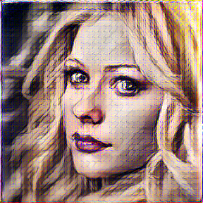

   
   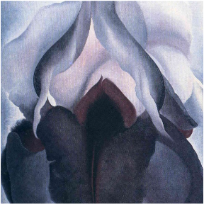
   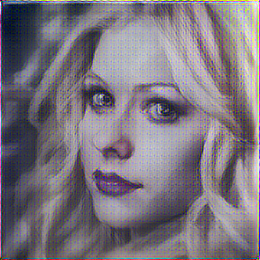

   
   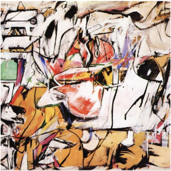
   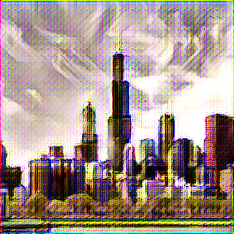

   
   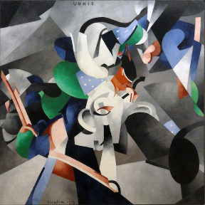
   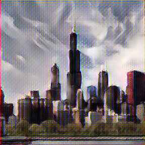

   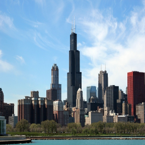
   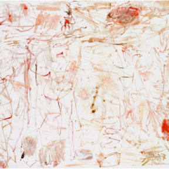
   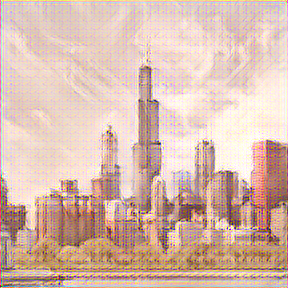

   
   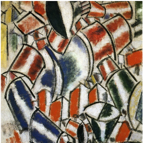
   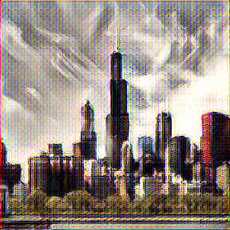

## Architecture

### Encoder
Trained VGG till conv4_1 is our encoder.

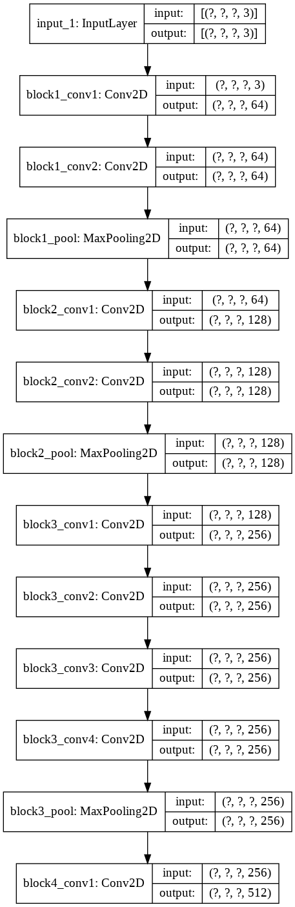

 

### Decoder
Our trainable decoder architecture

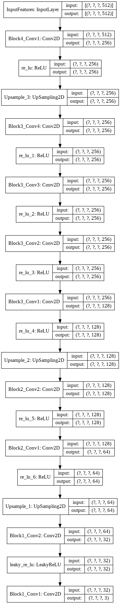

 

### Adaptive Instance Normalization layer (AdaIN)
Adaptive Instance normalizatin layer as proposed in paper

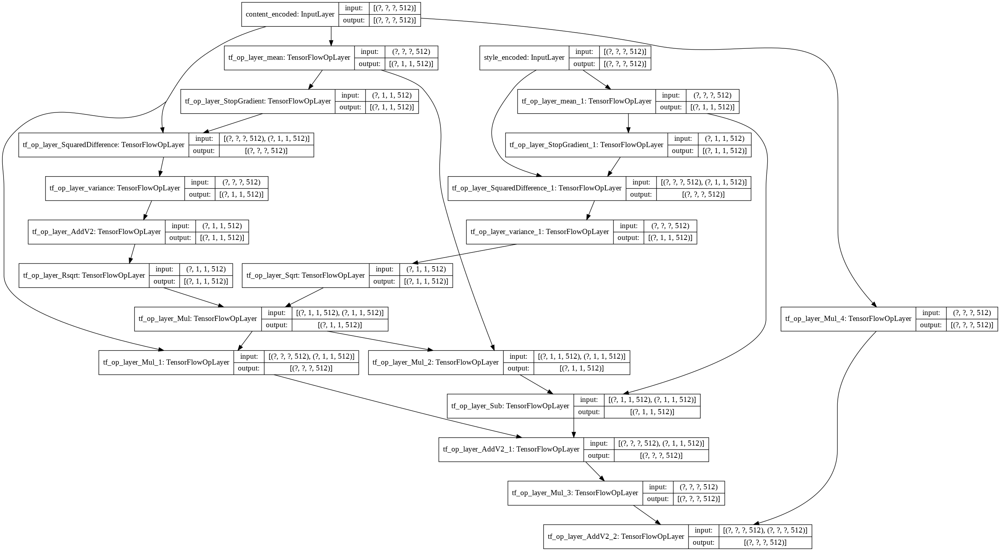
 

### Final Complete architecture
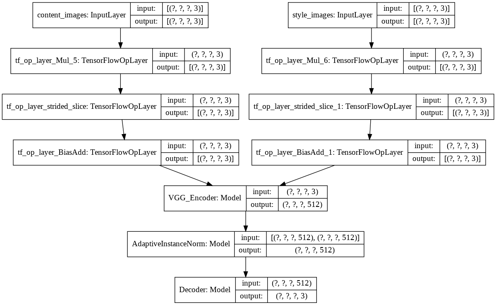
